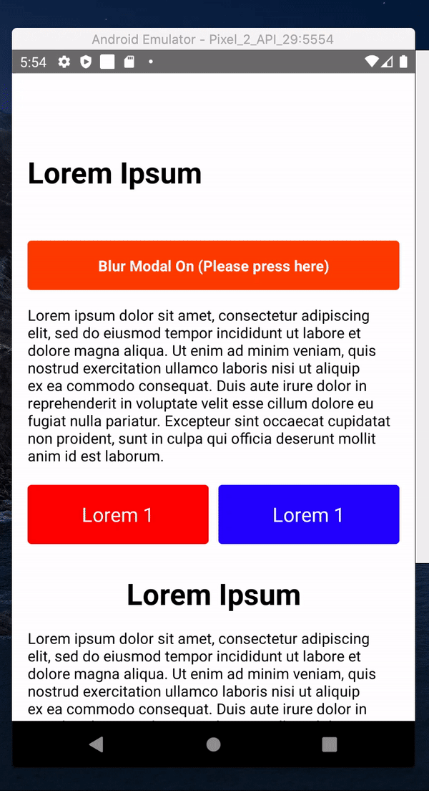

# rn-blur-background-modal-sample

Sample code for Blur Background Modal on React Native

## Dependencies

- [@react-native-community/blur](https://github.com/react-native-community/react-native-blur)
- [react-native-modal](https://github.com/react-native-community/react-native-modal)

## Note

The package `react-native-community/blur` has native dependencies for each of them. So it works very different way on IOS/Android. As my understanding, on `IOS`, it works as a invisible layer that makes everything blur behind them. So you can put it everywhere you want it to be blur.
But on `Android`, it needs specific target ref to make blur.
You need to get ref from the target `View`, `Image` or whatever, and find node handle of it, pass it to `BlurView` as `viewRef prop`. Then, i think android copies passed target ref, lower the quality of that component (blurring), so you can put that blurred component where you want. So, on Android, it's not a blurring layer, it's just a coppied component that looks blur.

So, be careful for the below,

On Android, it coppies original component and make it blur. So if the original component doesn't have background, blurred component will not have background as well.
`THEREFORE, THE TARGET COMPONENT SHOULD HAVE BACKGROUND OR THE MODAL SHOULD HAVE BACKGROUND`
Otherwise, blurred component overlaps original component, so it will look weird`

## Result

